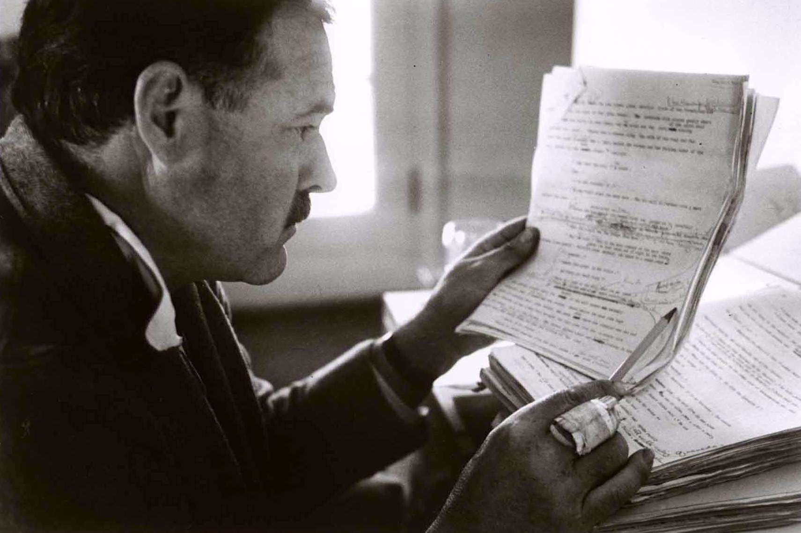
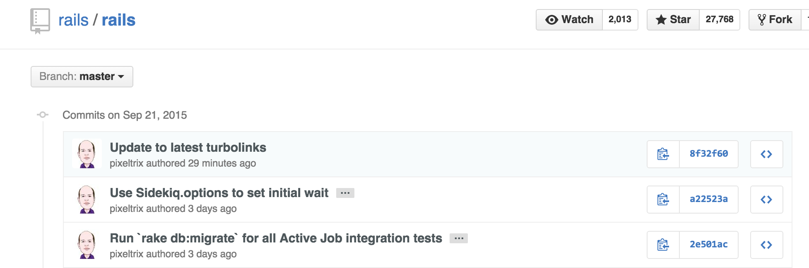

# Even Hemingway Wasn't Hemingway
### Ian Whitney
### @iwhitney
### https://github.com/ianwhitney/hemingway


### Writers keep changing words


### ~~Writers keep changing words~~
### Writers write several drafts


### ~~Writers keep changing words~~
### ~~Writers write several drafts~~
### Writers edit


### ~~Writers keep changing words~~
### ~~Writers write several drafts~~
### ~~Writers edit~~
### Writers Rewrite


# The Best Writing Is Rewriting
### E. B. White


# Writing is Rewriting

Note:
Writers value rewriting so much that they even rewrite their own maxim about rewriting. If they like rewriting so much, it must have value. They know the value of rewriting. It clarifies their early drafts and sharpens their message. Ernest Hemingway was blunt about drafts


# The first draft of anything is shit
### Ernest Hemingway




Note:
And here he is doing some of that rewriting. Taking a draft and revising it to something like:


### Simple exchange of values. You give them money. They give you a stuffed dog.<br />
_The Sun Also Rises_

Note:
I'm focusing on Hemingway because his style is known for precision, terseness and clarity. These are all features that I strive for in my code.


# Wait, coding isn't writing.


# Sure it is!


# It Tells Stories

```ruby
5.times { |count| puts "#{count}!" }
```

Note:
Sometimes the story is dumb. But it always tells a story. It might be a terse, simple story. Or maybe it's complex with a lot of twists and turns.


# It Has Drafts




# It Has Rewrites
## We just call it refactoring


### Writing Is Rewriting
###   We Rewrite Code
###    Therefore...


### Coding Is Writing!
#### Note: I never did take a logic class


#### But if coding is writing
#### And professional, famous writers can't write 
#### Then what hope do I have?


Just like a 'real' writer, you rewrite your code.
As you work with your code, you find ways to improve it.
As you learn more about what your code should do, you refactor it to make it do that.


# None!


# Actually, 'real' writers have it better
# They get to publish!
##### Well, sometimes


# But your code is never finished


# Which means that it's always a draft


# So you better get really good at rewriting


# But, wait
## You already told us how to fix our code
## Refactoring


# Well, kind of


Saying "just refactor" is kind of teaching someone to dance by dropping them off at Radio Music Hall and yelling "Good Luck!"


There are a lot of ways to Refactor. Each with their own plusses, minuses and techniques.


So we're going to look at just two.


And since code is writing, turns out those 'real' writers have the same techniques.


To start, let's look at Hemingway again


Note:
What's he doing here?
It's hard to see, but a lot of it is crossed out words replaced with other words.
Let's follow his example and see what this looks like in code.


# First Draft
```ruby
def lemur_renamer(lemurs)
  lemurs.each do |x|
    x.update_name(LemurNames.a_lemur_name)
  end
end
```

Note:
lemur.io lets people manage their lemur collections. Lemurs (or their owners) get bored of their names pretty quickly, so the owners want to be able to rename all of their lemurs at once using randomly picked names. This code works, but we can do some rewriting like what we saw Hemingway do.


# First Draft:
```ruby
def lemur_renamer(lemurs)
  lemurs.each do |x|
    x.update_name(LemurNames.a_lemur_name)
  end
end
```
---
# Rewritten:
```ruby
def lemur_renamer(lemurs)
  lemurs.each { |lemur| lemur.update_name(LemurNames.random) }
end
```

Note:
In this we've changed an opaque variable, x, to a descriptive one, lemur. We've replaced loop with a more idiomatic block. And we changed how we get a random lemur name. This is all to the good. Style changes like this are massive boons to everyone who has to look at our code.


#  Style Matters
## I put money in his hand -- he gave me a stuffed dog; I sure do like economic systems based on exchange of goods for fiat currency!


# But


# The Story Remained the Same


# First Draft:
```ruby
def lemur_renamer(lemurs)
  lemurs.each do |x|
    x.update_name(LemurNames.a_lemur_name)
  end
end
```
---
# Rewritten:
```ruby
def lemur_renamer(lemurs)
  lemurs.each { |lemur| lemur.update_name(LemurNames.random) }
end
```

Note:
We still loop through a collection of lemurs and give each one a new, randomly selected Lemur Name. Our code is clearer, yes. But the story it tells is the same.


# We changed Style
# We did not change Structure


# Stylistic Refactoring

Note:
Martin Fowler calls these kinds of refactorings 'Litter-Pickup' and  'Comprehension Refactoring'. I prefer stylistic as a term to encompass both of those ideas


# Stylistic Refactoring
### What it does
- Clarifies your story
- Eases comprehension

Note:
Stylistic refactoring is great for when you're trying to _clarify_ code. Variable names, idioms, style guides.


# Stylistic Refactoring
### What it doesn't do
- Change the story your code tells

Note:
You can make your story easier to understand, but you're not going to change the plot.


# How Much of Your Job is
- Improve our coding style
- Change the code to do something new/better?

Note: 
Most of my job, and I suspect most of yours, is changing the story my code tells. That tells me that as important as comprehensible code is, I probably can't spend my entire day working on it.


# How do we change our stories?


# Let's check in with Hemingway


Note:
Here's Ernest again. His rewrites also involved large structural changes. He'd do things like start writing about one character, change his mind and then make the book about a different character. Not just change the name; a previously secondary character simply became the main character 


# Wait. What?
Hemingway didn't know the main character of his own book?


# You Can't Know Story In Advance
## You Discover it through drafts


- Write a draft, learn about your story
- Rewrite, applying that knowledge to the draft
- Repeat


# Write a draft
This part's easy. All we do is write drafts.


# Learn about your story
- Bugs!
- Feature requests
- Code that hard to use or test

Note:
These are probably the main ways we learn what our stories should be. The code does not do what we want it to do, so we want to have it do something different.


# Apply our new knowledge


Note:
That's most of this book, and how you do this is going to depend on what kind of knowledge you are trying to apply. Let's take a look at a simple example.


# Our Current Knowledge
## People want to rename lemurs with one of our randomly selected names


# Our Knowledge Changes
> Feature Request: Users can maintain their own set of names that are used when renaming their lemurs.


# Our New Knowledge
## Update each lemur with a random name from the user, if present, or from Lemur Names.


# Now Change Our Story

```ruby
def lemur_renamer(lemurs, names = LemurNames)
  lemurs.each { |lemur| lemur.update_name(names.random) }
end
```

Note:
This is the 'add_parameter' refactoring pattern. And it doesn't look like much, but it has changed the story our code tells. Update each lemur with a random name from the provided names, or from Lemur Names


# We changed Structure
# We did not change Style


# Structural Refactoring

Note:
Fowler uses several terms for this "Prepatory", "Planned", "Long Term". But those cover *when* you'd do the refactoring, not *what* you're actually doing. So I like the term "Structural", since we're changing Structure..


# Structural Refactoring
- Adds new knowledge to the application


# Structural Refactoring
### What it does
- Changes your story
- Encodes your new knowledge in the code

Note:
Structural change is great for encoding new knowledge into your system. Before we didn't know that more than one set of lemur names was necessary, now our story clearly states than _any_ collection of names can be used.


# Structural Refactoring
### What it doesn't do
- Make you a rockstar


Because rockstars are _perfect_
They don't need drafts, refactoring or any of that.
They just get it **right**


They also don't exist.


This is not a surprise. We all know that rockstars are mythical.


But yet...


We look at code we wrote and are sad
We want to write great code right away
We want to be rockstars

Every writer has the same secret. 
Write, then rewrite and rewrite and rewrite.

Note:
And rewrite, and rewrite. Forever. Hemingway wasn't a rockstar. No author you've ever read was a rockstar.


# Admit That Your Code is a Draft
# Enjoy that you know more now then you knew then
# Be proud to make it better
# But realize that it's still a draft


# Even Hemingway wasn't Hemingway
