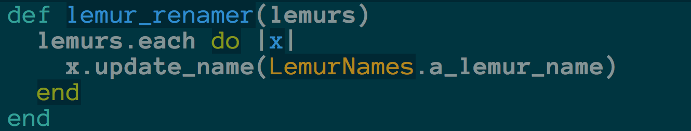
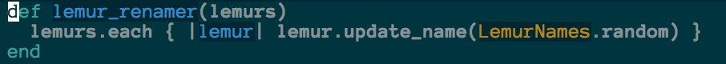
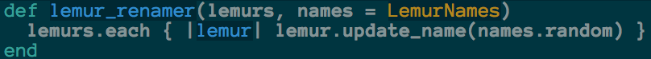

## Even Hemingway Wasn't Hemingway
-  Ian Whitney
-  @iwhitney
-  https://github.com/ianwhitney/hemingway


# This is a talk about refactoring


#### Except, I'm not going to tell you how to refactor


#### I will talk about types of refactoring, and what they offer


#### Mostly, I want to talk about why you should be happy to refactor


#### And how we can learn from 'real' writers


### Writers keep changing words
Note:
Real writers, like Hemingway, like to keep changing their words....


### ~~Writers keep changing words~~
### Writers write several drafts


### ~~Writers keep changing words~~
### ~~Writers write several drafts~~
### Writers edit


### ~~Writers keep changing words~~
### ~~Writers write several drafts~~
### ~~Writers edit~~
### Writers Rewrite


# The Best Writing Is Rewriting
### E. B. White


# Writing is Rewriting

Note:
Writers value rewriting so much that they even rewrite their own maxim about rewriting. If they like rewriting so much, it must have value. They know the value of rewriting. It clarifies their early drafts and sharpens their message. Ernest Hemingway was blunt about drafts


## The first draft of anything is shit
### Ernest Hemingway


Note:
And here he is doing some of that rewriting. Taking a draft and revising it to something like:


### Simple exchange of values. You give them money. They give you a stuffed dog.<br />
_The Sun Also Rises_

Note:
I'm focusing on Hemingway because his style is known for precision, terseness and clarity. Which I strive for in my own code. And he was honest that his style took work. That he wasn't a magical unicorn that could write perfect first drafts. Some of you may be wondering why I keep comparing myself to a prose writer. There's an obvious concern here.


# Coding isn't writing.


# Sure it is!


# It Tells Stories

```ruby
5.times { |count| puts "#{count}!" }
```

Note:
Sometimes the story is dumb. But it always tells a story. It might be a terse, simple story. Or maybe it's complex with a lot of twists and turns.


# It Has Drafts


Note:
Speaking of complex stories...When I took this screen shot, the rails repo had over 53,000 commits. That is a lot of drafts.


# It Has Rewrites
#### We just call it refactoring<br />
<small>We don't like the word 'rewrite'</small>

Note:
And with good reason. How many doomed projects have started with, "This is a total rewrite."


## Logic!
### If Writing Is Rewriting
###   And We Rewrite Code
###    Then&hellip;


## Coding Is Writing!
##### Note: I never did take a logic class


#### But if coding is writing
#### And professional, famous writers can't write good first drafts
#### Then what hope do I have?


# None!

Note:
Just like a 'real' writer, you rewrite your code.
As you work with your code, you find ways to improve it.
As you learn more about what your code should do, you refactor it to make it do that.


## 'Real' writers have it better
#### They get to publish!
<small>Well, sometimes</small>

Note:
Books, articles, etc don't tend to change much once they ship. But we're not so lucky.


## Our code is never finished

Note:
As long as it's running somewhere, we probably need to make changes to it.


## Which means that it's always a draft

Note:
As long as we're changing code, we're still learning about it, improving it, rewriting it.


## So you better get really good at rewriting

Note:
Ah, there's that word again.


## I mean refactoring


# This is not helpful advice


Saying "just refactor" is kind of teaching someone to dance by dropping them off at Radio City Music Hall and yelling "Good Luck!"


There are a lot of ways to Refactor. Which approach you pick depends on what you're trying to achieve.


We're going to look at the two general families of refactorings


And since coding is writing, turns out those 'real' writers have the same techniques.


To start, let's look at Hemingway again


Note:
What's he doing here?
It's hard to see, but a lot of it is crossed out words replaced with other words.
Let's follow his example and see what this looks like in code.


# First Draft


Note:
lemur.io lets people manage their lemur collections. Lemurs (or their owners) get bored of their names pretty quickly, so the owners want to be able to rename all of their lemurs at once using randomly picked names. This code works, but we can do some rewriting like what we saw Hemingway do.


## First Draft:

---
## Second Draft:


Note:
In this we've changed an opaque variable, x, to a descriptive one, lemur. We've replaced loop with a more idiomatic block. And we changed how we get a random lemur name. This is all to the good. Style changes like this are massive boons to everyone who has to look at our code.


#  Style Matters
> I put money in a hand -- he gave me a stuffed dog; I sure do like economic systems based on exchange of goods for fiat currency!


# But&hellip;


# The Story Remained the Same


## First Draft:

---
## Second Draft:


Note:
We still loop through a collection of lemurs and give each one a new, randomly selected Lemur Name. Our code is clearer, yes. But the story it tells is the same.


### We changed Style
### We did not change Structure


# Stylistic Refactoring

Note:
Martin Fowler calls these kinds of refactorings 'Litter-Pickup' and  'Comprehension Refactoring'. I prefer stylistic as a term to encompass both of those ideas.


## Stylistic Refactoring
### What it does
- Clarifies your story
- Eases comprehension

Note:
Stylistic refactoring is great for when you're trying to _clarify_ code. Variable names, idioms, style guides.


## Stylistic Refactoring
### What it doesn't do
- Change the story your code tells

Note:
You can make your story easier to understand, but you're not going to change the plot.


# Quick Poll
### How Much of Your Job is
- Improve your coding style
- Change the code to do something new/better?

Note:
Most of my job, and I suspect most of yours, is changing the story my code tells. That tells me that as important as comprehensible code is, I probably can't spend my entire day working on it.


# How do we change our stories?


### Well, how do writers change their stories?


Note:
Here's Ernest again. His rewrites also involved large structural changes. He'd written a large part of _The Sun Also Rises_ before decided to change the novel's main character.  This wasn't a simple matter of just changing a name, no. He rewrote the novel so that a previously secondary character became the main character  This led to my question...


# Wait. What?
Hemingway didn't know the main character of his own book?

Note:
Like I said earlier, not even famous writers get this stuff right the first try. Or the second, third, etc. Which I think tells us something important about stories.


# You Can't Know Story In Advance


## You Discover it through drafts
### Many, many drafts

- Write a draft
- Learn about your story
- Rewrite, applying that knowledge to the draft
- Repeat


# Write a draft
This part's easy. Just write some code.<br />
It's always a draft.


# Learn about your story
- Bugs!
- Feature requests
- Code that hard to use or test

Note:
These are probably the main ways we learn what our stories should be. The code does not do what we want it to do, so we want to have it do something different.


# Apply your new knowledge


Note:
That's most of this book, and how you do this is going to depend on what kind of knowledge you are trying to apply. Let's take a look at a simple example.


## Our Current Knowledge
> People want to rename lemurs with one of our randomly selected names


## Our Knowledge Changes
> Feature Request: Users can maintain their own set of names that are used when renaming their lemurs.


## Our New Knowledge
> Update each lemur with a random name from the user, if present, or from Lemur Names.


## Change Our Story


Note:
This is the 'add_parameter' refactoring pattern. And it doesn't look like much, but it has changed the story our code tells. Update each lemur with a random name from the provided names, or from Lemur Names


### We changed Structure
### We did not change Style


# Structural Refactoring

Note:
Fowler uses several terms for this: "Preparatory", "Planned", "Long Term". But those cover *when* you'd do the refactoring, not *what* you're actually doing. So I like the term "Structural", since we're changing Structure.


## Structural Refactoring
### What it does
- Changes your story
- Encodes your new knowledge in the code

Note:
Structural change is great for encoding new knowledge into your system. Before we didn't know that more than one set of lemur names was necessary, now our story clearly states than _any_ collection of names can be used.


## Structural Refactoring
### What it doesn't do
- Make it easier to write perfect code next time


Because perfect drafts don't exist


But yet...


We look at code we wrote and are sad<br />
We want to write great code right away<br />
We want to be rockstars


Every writer has the same secret.<br />
Write, then rewrite and rewrite and rewrite.

Note:
And rewrite, and rewrite. Forever. Hemingway wasn't a rockstar. No author you've ever read was a rockstar.


## Admit That Your Code is a Draft

Note:
Realizing that your code will always change makes it easier to accept and focus on the improvement, instead of being sad about your 'bad' code.


## Revel in your increasing smarts

Note:
I have a project I'm working on where I know that the code is not what I want. But I know that I will learn how to make that code better.


## Be proud to make it better

Note:
And when I do fix that code, I'm going to be justifiably proud that I have improved it


## But realize that it's still a draft

Note:
But I'm going to know that it will change again. Soon, probably.


## Even Hemingway wasn't Hemingway

Note:
He didn't write perfect prose. He improved through mistakes and rewrites. And that is true of every 'real' writer.


# Including You


## &c.
- Ian Whitney
- @iwhitney
- https://github.com/ianwhitney/hemingway
- Thanks to Davin Lagerroos & Pedro Chambino
